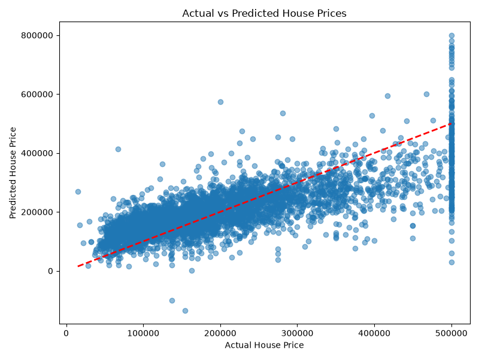

# house-prices-prediction
# House Price Prediction

A machine learning project that predicts house prices using Linear Regression, built with Python and scikit-learn.

## Overview
This project uses the California Housing dataset to predict median house values based on features like income, location, and housing age. It covers the full ML workflow: data loading, cleaning, feature selection, model training, evaluation, and visualization.

## Tech Stack
- Python
- pandas, numpy
- scikit-learn (Linear Regression)
- matplotlib (data visualization)

## Features Used
- Median income
- Housing median age
- Total rooms
- Total bedrooms
- Population
- Households

## Results
- **Mean Absolute Error (MAE):** 56,713.67
- **R² Score:** 0.5445

The model explains about 54% of the variance in house prices, demonstrating a solid baseline regression approach.

## Visualization
The scatter plot below compares actual vs predicted house prices, with the red dashed line representing perfect predictions.

## How to Run
pip install pandas numpy matplotlib scikit-learn
python "House Prices.py"
